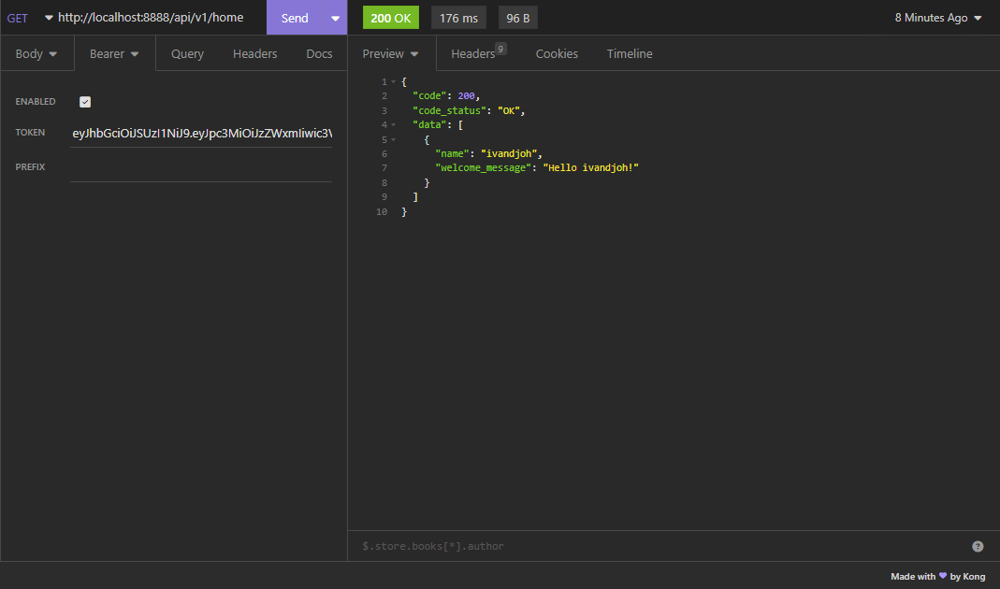
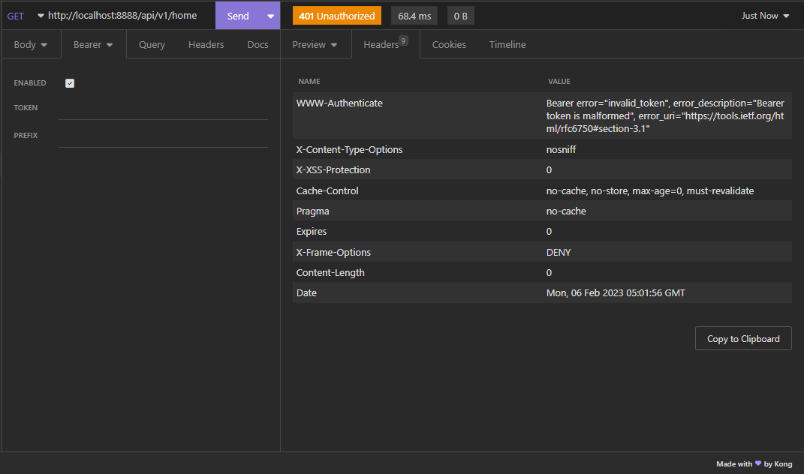

## My Spring JWT

### About
This is a simple way how to `Secure` My Spring Boot Api Endpoint using JWT

```bash
THIS PROJECT STILL IN DEVELOPMENT
```

***

- Create pem file with openssl
```bash
openssl genrsa -out keypair.pem 2048
```

- Create public key from pem file
```bash
openssl rsa -in keypair.pem -pubout -outform PEM -out public.pem
```

- Create private key from pem file
```bash
openssl pkcs8 -topk8 -inform PEM -outform PEM -nocrypt -in keypair.pem -out private.pem
```

- Hit the endpoint
```bash
http POST :8000/token --auth ivandjoh=password -v
```

### Screenshots

*** Create Token ***


*** Success Token ***


*** Failed Token *
